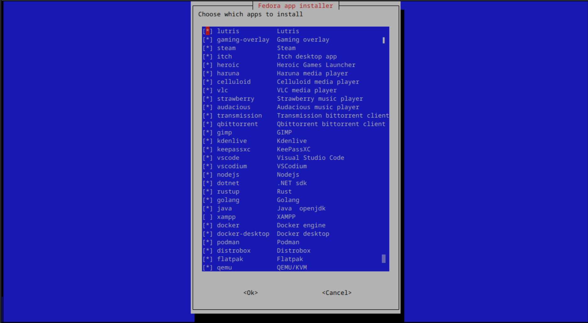

# Welcome to Linux Distro Post Install Scripts! 👋

![Stargazers][star-shield]
[![GitHub License][license-shield]][license-url]
![GitHub code size in bytes][size-shield]
[![GitHub last commit][commit-shield]][commit-url]
[![GitHub Issues][issue-shield]][issue-url]

[star-shield]: https://img.shields.io/github/stars/KnightTheCoder/Linux-Distro-Post-Install-Scripts?style=for-the-badge

[license-shield]: https://img.shields.io/github/license/KnightTheCoder/Linux-Distro-Post-Install-Scripts?color=blue&style=for-the-badge
[license-url]: LICENSE

[size-shield]: https://img.shields.io/github/languages/code-size/KnightTheCoder/Linux-Distro-Post-Install-Scripts?color=blue&style=for-the-badge

[commit-shield]: https://img.shields.io/github/last-commit/KnightTheCoder/Linux-Distro-Post-Install-Scripts?color=blue&style=for-the-badge
[commit-url]: https://github.com/KnightTheCoder/Linux-Distro-Post-Install-Scripts/activity

[issue-shield]: https://img.shields.io/github/issues/KnightTheCoder/Linux-Distro-Post-Install-Scripts?color=green&style=for-the-badge
[issue-url]: https://github.com/KnightTheCoder/Linux-Distro-Post-Install-Scripts/issues

<h2 align="center">Post install script</h2>

<p align="center">
    <a href="#-requirements">Requirements</a>
    ·
    <a href="#-usage">Usage</a>
    ·
    <a href="#-features">Features</a>
    ·
    <a href="#-firefox-policy-optional">Firefox policy</a>
    ·
    <a href="#-project-breakdown">Project breakdown</a>
</p>

<p align="center">A collection of scripts for getting a new system up and running easily</p>



## Supported distros
* [OpenSUSE][1]
* [Fedora][2]
* [Debian][3]
* [Arch linux][4]

Tested distros:
* OpenSUSE Tumbleweed
* OpenSUSE Leap
* Fedora
* Debian
* Ubuntu
* Linux Mint
* ZorinOS
* Pop!_OS
* MX Linux
* Arch Linux
* EndeavourOS
* Manjaro

> Written in Bash and whiptail <br />
> 

> [!NOTE]
> Originally designed for OpenSUSE Tumbleweed KDE <br />
> Only tested with the x86 architecture

> [!IMPORTANT]
> If you're using a very old iso, update the system and restart before running the script <br />
> Recommended on archlinux and OpenSUSE Tumbleweed

## 🛠 Requirements
* wget (to download the scripts)
* unzip (to unzip the scripts)
* bash (to run the scripts)
* systemd (needed to start services)

## 💡 Usage

> [!NOTE]
> Step 1: Download scripts (will be downloaded to your downloads directory) <br />
> Step 2: Navigate to the downloaded scripts and unzip them <br />
> Step 3: Run the script

<details>
<summary>Stable</summary>

```console
wget -O "$(xdg-user-dir DOWNLOAD)/post-install-scripts.zip" "https://github.com/KnightTheCoder/Linux-Distro-Post-Install-Scripts/archive/refs/heads/master.zip"

cd "$(xdg-user-dir DOWNLOAD)" && unzip -o post-install-scripts.zip && cd Linux-Distro-Post-Install-Scripts-master

bash ./post_install.sh
```
</details>

<details>
<summary>Experimental</summary>

```console
wget -O "$(xdg-user-dir DOWNLOAD)/post-install-scripts.zip" "https://github.com/KnightTheCoder/Linux-Distro-Post-Install-Scripts/archive/reos/heads/maintanence.zip"

cd "$(xdg-user-dir DOWNLOAD)" && unzip -o post-install-scripts.zip && cd Linux-Distro-Post-Install-Scripts-maintanence

bash ./post_install.sh
```
</details>

<details>
<summary>To copy the firefox policy</summary>

#### Run with
```console
bash ./post_install.sh --copy-firefox-policy
```
</details>

## ✨ Features
* Choose the apps and configurations you need
* Updates the system
* Sets up flatpak and install apps
* Downloads and installs microsoft and hack nerd fonts
* Installs Visual Studio Code and Codium extensions and copies the keybindings
* Installs gaming launchers such as Steam, lutris, itch desktop app
* Adds the following command line utilities: neofetch, htop, btop, neovim, eza, bat
* Installs wine and Protonup-Qt to run windows games
* Sets up fish and zsh
* Installs NvChad or Astrovim for neovim
* Installs the GitHub CLI
* Installs docker, podman and distrobox for containers
* Installs code editors: vscode, vscodium
* Installs programming languages and development environments: gcc, nodejs, dotnet, rust, go, java, xampp                       
* Optionally sets hostname

## ❓ Why use it?
Post install script for linux aims to quickly setup a system with the same configuration/software across multiple distros.

The scripts are meant to be reproducable and allow you to get to using your new system/virtual machine rather than try to replicate your already existing setup.

You only need to configure apps and configuration files once when changing the project to suit your own needs and be able to use it afterwards.

## 📃 Steps the script runs:
* Find package manager
* Check for whiptail and install it if it's not found
* Find Distro, ask if distro is correct, if distro and package manager don't match stop script
* Start distro specific script
* Select programs/tools to install
* Add list of recommended packages (bat, eza, git, etc.)
* Select shells to setup
* Select neovim configuration
* Break down programs/tools into setup steps (packages, services, usergroups, setups, etc.)
* Distro specific setup (add repos, install codecs, etc.)
* Add user to usergroups listed before
* Run setups for selected apps
* Start listed services
* Ask for hostname (optional)

## 💻 Project location
By using the provided commands the scripts will be downloaded and unzipped in your language's Downloads folder

(run ``xdg-user-dir DOWNLOAD`` to find out the location of yours)

## 🌐 Firefox policy (optional)
A firefox policy is included for increased security.

Can be found at ``config/firefox/policies.json``

Manually edit to customize, then copy to ``/etc/firefox/policies/`` for it to work

### 📖 Included policy has the following changes
* Disable telemetry
* Disable firefox studies
* Disable pocket
* Disable form history
* Disable feedback commands
* Enable all tracking protection
* Don't offer to save logins
* Block requests for notifications
* Block audio and video autoplay
* Disable picture in picture
* Always ask for download location
* Disable autofill address
* Disable autofill creditcard
* No default bookmarks (only works if you copied the policies.json before opening firefox for the first time)

### 📦 Installs basic extensions for privacy (can be removed anytime)
* [uBlock Origin][5]
* [Privacy Badger][6]
* [CanvasBlocker][7]
* [User-Agent Switcher and Manager][8]
* [LocalCDN][9]
* [ClearURLs][10]
* [Skip Redirect][11]

### Optional extensions

#### Youtube
* [Enhancer for YouTube][12]
* [DeArrow][13]
* [Return YouTube Dislike][14]
* [SponsorBlock][15]

#### Steam
* [Augmented Steam][16]
* [ProtonDB for Steam][17]

#### Utilities
* [Dark Reader][18]
* [Save webP as PNG or JPEG (Converter)][19]


## 📂 Project breakdown

### Project structure
```bash
.
├── config
│   ├── firefox
│   │   └── policies.json
│   ├── fish
│   │   ├── config_debian.fish
│   │   └── config.fish
│   └── vscode
│       ├── keybindings.json
│       └── settings.json
├── distros
│   ├── arch
│   │   ├── README.md
│   │   └── setup.sh
│   ├── debian
│   │   ├── README.md
│   │   └── setup.sh
│   ├── fedora
│   │   ├── README.md
│   │   └── setup.sh
│   └── opensuse
│       ├── README.md
│       └── setup.sh
├── images
│   └── preview.png
├── LICENSE
├── post_install.sh
├── README.md
└── shared
    ├── setup.fish
    ├── setup.zsh
    └── shared_scripts.sh
```

### Config
Pre-made configuration files, these are meant to be copied and not changed

### Distros
Distro specific setups that will execute the specific steps for them:
example: using the distro's package manager and approprioate package names, repos

### Shared
Shared scripts between all distro setups, these include shell setup and program specific setups like installing hack nerd fonts, setting up scripts with plugin managers, neovim configurations, flatpaks, etc.

### Images
Images for the README page

[1]: distros/opensuse#readme
[2]: distros/fedora#readme
[3]: distros/debian#readme
[4]: distros/arch#readme

[5]: https://addons.mozilla.org/en-US/firefox/addon/ublock-origin/
[6]: https://addons.mozilla.org/en-US/firefox/addon/privacy-badger17/
[7]: https://addons.mozilla.org/en-US/firefox/addon/canvasblocker/
[8]: https://addons.mozilla.org/en-US/firefox/addon/user-agent-string-switcher/
[9]: https://addons.mozilla.org/en-US/firefox/addon/localcdn-fork-of-decentraleyes/
[10]: https://addons.mozilla.org/en-US/firefox/addon/clearurls/
[11]: https://addons.mozilla.org/en-US/firefox/addon/skip-redirect/

[12]: https://addons.mozilla.org/en-US/firefox/addon/enhancer-for-youtube/
[13]: https://addons.mozilla.org/en-US/firefox/addon/dearrow/
[14]: https://addons.mozilla.org/en-US/firefox/addon/return-youtube-dislikes/
[15]: https://addons.mozilla.org/en-US/firefox/addon/sponsorblock/

[16]: https://addons.mozilla.org/en-US/firefox/addon/augmented-steam/
[17]: https://addons.mozilla.org/en-US/firefox/addon/protondb-for-steam/

[18]: https://addons.mozilla.org/en-US/firefox/addon/darkreader/
[19]: https://addons.mozilla.org/en-US/firefox/addon/save-webp-as-png-or-jpeg/