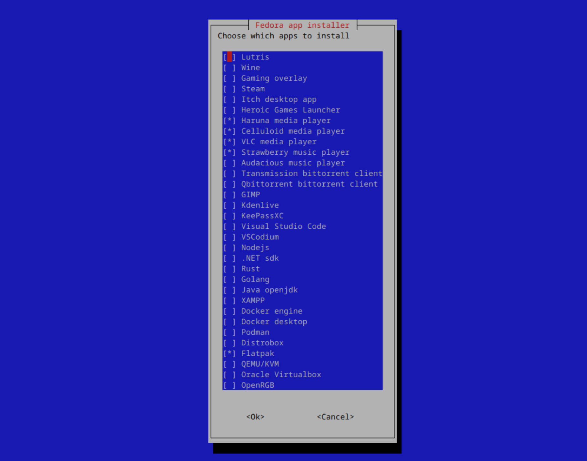

# Welcome to Linux Distro Post Install Scripts! 👋

![Stargazers][star-shield]
[![GitHub License][license-shield]][license-url]
![GitHub code size in bytes][size-shield]
[![GitHub last commit][commit-shield]][commit-url]
[![GitHub Issues][issue-shield]][issue-url]

[star-shield]: https://img.shields.io/github/stars/KnightTheCoder/Linux-Distro-Post-Install-Scripts?style=for-the-badge

[license-shield]: https://img.shields.io/github/license/KnightTheCoder/Linux-Distro-Post-Install-Scripts?color=blue&style=for-the-badge
[license-url]: LICENSE

[size-shield]: https://img.shields.io/github/languages/code-size/KnightTheCoder/Linux-Distro-Post-Install-Scripts?color=blue&style=for-the-badge

[commit-shield]: https://img.shields.io/github/last-commit/KnightTheCoder/Linux-Distro-Post-Install-Scripts?color=blue&style=for-the-badge
[commit-url]: https://github.com/KnightTheCoder/Linux-Distro-Post-Install-Scripts/commits/master/

[issue-shield]: https://img.shields.io/github/issues/KnightTheCoder/Linux-Distro-Post-Install-Scripts?color=green&style=for-the-badge
[issue-url]: https://github.com/KnightTheCoder/Linux-Distro-Post-Install-Scripts/issues

<h2 align="center">Post install script</h2>

<p align="center">
    <a href="#-requirements">Requirements</a>
    ·
    <a href="#-usage">Usage</a>
    ·
    <a href="#-features">Features</a>
    ·
    <a href="docs">Project documentation</a>
</p>

<p align="center">A collection of scripts for getting a new system up and running easily</p>



> [!NOTE]
> Click on distros for distro specific features and information

## Supported distros
* [OpenSUSE][1]
* [Fedora][2]
* [Debian][3]
* [Arch linux][4]

Tested distros:
* OpenSUSE Tumbleweed
* OpenSUSE Leap
* Fedora
* Debian
* Ubuntu
* Linux Mint
* ZorinOS
* Pop!_OS
* MX Linux
* Arch Linux
* EndeavourOS
* Manjaro Linux

> Written in Bash and whiptail <br />
> 

> [!NOTE]
> Originally designed for OpenSUSE Tumbleweed KDE <br />
> Only tested with the x86 architecture

> [!IMPORTANT]
> If you're using a very old iso, update the system and restart before running the script <br />
> Recommended on Arch Linux and OpenSUSE Tumbleweed

## 🛠 Requirements
* wget (to download the scripts)
* unzip (to unzip the scripts)
* bash (to run the scripts)
* systemd (needed to start services)

## 💡 Usage

> [!NOTE]
> Step 1: Download scripts (will be downloaded to your downloads directory) <br />
> Step 2: Navigate to the downloaded scripts and unzip them <br />
> Step 3: Run the script

<details open>
<summary>Stable</summary>

```console
wget -O "$(xdg-user-dir DOWNLOAD)/post-install-scripts.zip" "https://github.com/KnightTheCoder/Linux-Distro-Post-Install-Scripts/archive/refs/heads/master.zip"

cd "$(xdg-user-dir DOWNLOAD)" && unzip -o post-install-scripts.zip && cd Linux-Distro-Post-Install-Scripts-master

bash ./post_install.sh
```
</details>

<details>
<summary>Experimental</summary>

```console
wget -O "$(xdg-user-dir DOWNLOAD)/post-install-scripts.zip" "https://github.com/KnightTheCoder/Linux-Distro-Post-Install-Scripts/archive/refs/heads/maintanence.zip"

cd "$(xdg-user-dir DOWNLOAD)" && unzip -o post-install-scripts.zip && cd Linux-Distro-Post-Install-Scripts-maintanence

bash ./post_install.sh
```
</details>

<details>
<summary>To copy the firefox policy</summary>

#### Run with
```console
bash ./post_install.sh --copy-firefox-policy
```
</details>

## ✨ Features
* Choose the apps and configurations you need
* Updates the system
* Sets up flatpak and install apps
* Downloads and installs microsoft and hack nerd fonts
* Installs Visual Studio Code and Codium extensions and copies the keybindings
* Installs gaming launchers such as Steam, lutris, itch desktop app
* Adds the following command line utilities: neofetch, htop, btop, neovim, eza, bat
* Installs wine and Protonup-Qt to run windows games
* Sets up bash, fish and zsh
* Installs NvChad or Astrovim for neovim
* Installs the GitHub CLI
* Installs docker, podman and distrobox for containers
* Installs code editors: vscode, vscodium
* Installs programming languages and development environments: gcc, nodejs, dotnet, rust, go, java, xampp                       
* Optionally sets hostname

## ❓ Why use it?
Post install script for linux aims to quickly setup a system with the same configuration/software across multiple distros.

The scripts are meant to be reproducable and allow you to get to using your new system/virtual machine rather than try to replicate your already existing setup.

You only need to configure apps and configuration files once when changing the project to suit your own needs and be able to use it afterwards.

## 💻 Project location
By using the provided commands the scripts will be downloaded and unzipped in your language's Downloads folder

> [!NOTE]
> Run ``xdg-user-dir DOWNLOAD`` to find out the location of yours

## 🌐 Firefox policy
A firefox policy is included for increased privacy.

Increases privacy, removes telemetry and installs privacy extensions.

Full policy list and changes: [here](docs#-firefox-policy)

> [!NOTE]
> The policy is applied automatically when running the script with the ``--copy-firefox-policy`` argument <br />
> Can be found at ``config/firefox/policies.json`` <br />
> Manually edit to customize, then copy to ``/etc/firefox/policies/`` for it to work

[1]: distros/opensuse
[2]: distros/fedora
[3]: distros/debian
[4]: distros/arch